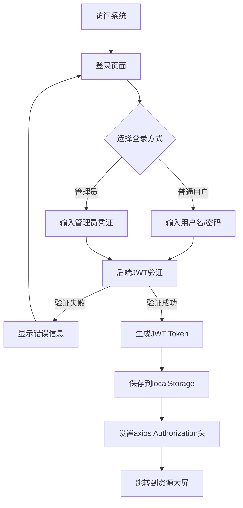
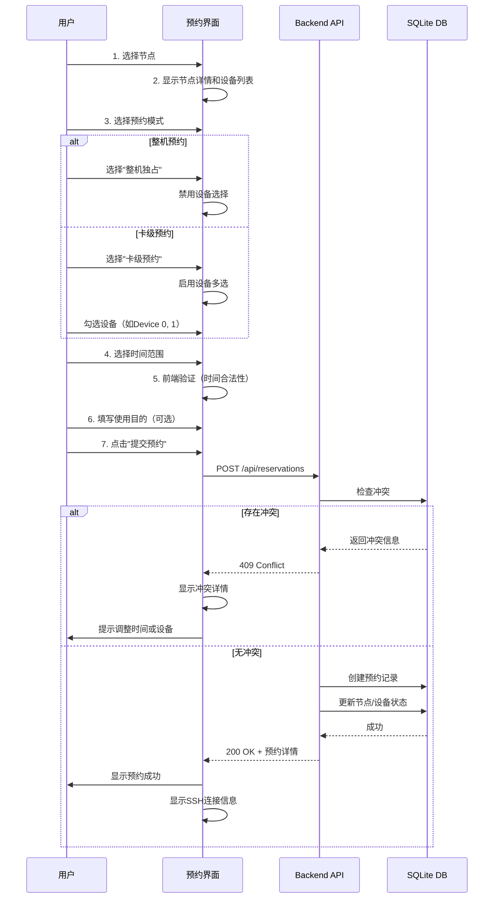

# ServerSentinel - 用户体验设计文档

## 1. 用户认证流程

### 1.1 登录流程



**实现细节**：

```javascript
// 前端登录逻辑
async function login(username, password) {
  try {
    const response = await axios.post('/api/auth/login', {
      username,
      password
    });
    
    // 保存Token和用户信息
    localStorage.setItem('token', response.data.access_token);
    localStorage.setItem('user', JSON.stringify(response.data.user));
    
    // 设置axios默认header
    axios.defaults.headers.common['Authorization'] = 
      `Bearer ${response.data.access_token}`;
    
    // 跳转到主页
    router.push('/dashboard');
  } catch (error) {
    message.error('登录失败：' + error.response.data.detail);
  }
}

// 页面刷新时自动恢复登录状态
function restoreAuth() {
  const token = localStorage.getItem('token');
  const user = localStorage.getItem('user');
  
  if (token && user) {
    axios.defaults.headers.common['Authorization'] = `Bearer ${token}`;
    return JSON.parse(user);
  }
  return null;
}
```

### 1.2 权限控制

```javascript
// 路由守卫
router.beforeEach((to, from, next) => {
  const user = restoreAuth();
  
  if (to.meta.requiresAuth && !user) {
    // 未登录，跳转到登录页
    next('/login');
  } else if (to.meta.requiresAdmin && user?.role !== 'admin') {
    // 需要管理员权限但用户不是管理员
    message.error('需要管理员权限');
    next('/dashboard');
  } else {
    next();
  }
});
```

## 2. 资源预约流程（核心功能）

### 2.1 创建预约流程



**前端表单设计**：

```vue
<template>
  <a-modal v-model:visible="visible" title="创建预约" width="600px">
    <a-form :model="form" :rules="rules" ref="formRef">
      <!-- 节点选择 -->
      <a-form-item label="选择节点" name="nodeId">
        <a-select v-model:value="form.nodeId" @change="onNodeChange">
          <a-select-option 
            v-for="node in nodes" 
            :key="node.id" 
            :value="node.id"
            :disabled="node.status !== 'online'"
          >
            {{ node.name }} ({{ node.ip_address }})
            <a-tag :color="node.status === 'online' ? 'green' : 'red'">
              {{ node.status }}
            </a-tag>
          </a-select-option>
        </a-select>
      </a-form-item>

      <!-- 预约模式 -->
      <a-form-item label="预约模式" name="mode">
        <a-radio-group v-model:value="form.mode">
          <a-radio value="full">
            整机独占
            <a-tooltip title="独占整台服务器的所有资源">
              <QuestionCircleOutlined />
            </a-tooltip>
          </a-radio>
          <a-radio value="device">
            卡级预约
            <a-tooltip title="仅预约指定的NPU卡">
              <QuestionCircleOutlined />
            </a-tooltip>
          </a-radio>
        </a-radio-group>
      </a-form-item>

      <!-- 设备选择（仅卡级模式） -->
      <a-form-item 
        v-if="form.mode === 'device'" 
        label="选择设备" 
        name="deviceIds"
      >
        <a-checkbox-group v-model:value="form.deviceIds">
          <a-row>
            <a-col 
              v-for="device in currentDevices" 
              :key="device.id" 
              :span="8"
            >
              <a-checkbox 
                :value="device.id"
                :disabled="device.status === 'reserved'"
              >
                Device {{ device.device_index }}
                <a-tag 
                  :color="device.status === 'idle' ? 'green' : 'orange'"
                  size="small"
                >
                  {{ device.status }}
                </a-tag>
              </a-checkbox>
            </a-col>
          </a-row>
        </a-checkbox-group>
      </a-form-item>

      <!-- 时间范围 -->
      <a-form-item label="使用时间" name="timeRange">
        <a-range-picker 
          v-model:value="form.timeRange"
          show-time
          format="YYYY-MM-DD HH:mm"
          :disabled-date="disabledDate"
        />
      </a-form-item>

      <!-- 使用目的 -->
      <a-form-item label="使用目的" name="purpose">
        <a-textarea 
          v-model:value="form.purpose"
          placeholder="请简要说明使用目的（可选）"
          :rows="3"
        />
      </a-form-item>
    </a-form>

    <template #footer>
      <a-button @click="visible = false">取消</a-button>
      <a-button type="primary" @click="handleSubmit" :loading="submitting">
        提交预约
      </a-button>
    </template>
  </a-modal>
</template>
```

### 2.2 我的预约管理

```mermaid
flowchart TD
    A[进入"我的预约"页面] --> B[GET /api/reservations/my]
    B --> C[显示预约列表]
    C --> D{预约状态}
    D -->|进行中| E[显示SSH连接信息]
    D -->|进行中| F[显示"释放"按钮]
    D -->|进行中| G[显示"延期"按钮]
    D -->|已结束| H[仅显示历史记录]
    F --> I[确认释放]
    I --> J[DELETE /api/reservations/:id]
    J --> K[更新列表]
    G --> L[选择新的结束时间]
    L --> M[POST /api/reservations/:id/extend]
    M --> N{检查冲突}
    N -->|有冲突| O[提示冲突]
    N -->|无冲突| P[延期成功]
```

**预约卡片设计**：

```vue
<a-card 
  v-for="reservation in myReservations" 
  :key="reservation.id"
  class="reservation-card"
>
  <template #title>
    <a-space>
      <ServerOutlined />
      {{ reservation.node.name }}
      <a-tag :color="getStatusColor(reservation.status)">
        {{ getStatusText(reservation.status) }}
      </a-tag>
    </a-space>
  </template>

  <a-descriptions :column="2" size="small">
    <a-descriptions-item label="预约模式">
      {{ reservation.mode === 'full' ? '整机' : '卡级' }}
    </a-descriptions-item>
    <a-descriptions-item label="设备" v-if="reservation.mode === 'device'">
      Device {{ reservation.devices.map(d => d.device_index).join(', ') }}
    </a-descriptions-item>
    <a-descriptions-item label="开始时间">
      {{ formatTime(reservation.start_time) }}
    </a-descriptions-item>
    <a-descriptions-item label="结束时间">
      {{ formatTime(reservation.end_time) }}
    </a-descriptions-item>
  </a-descriptions>

  <!-- SSH连接信息（仅活跃预约） -->
  <a-alert 
    v-if="reservation.status === 'active' && isCurrentTime(reservation)"
    type="success" 
    message="SSH连接信息"
    class="mt-3"
  >
    <template #description>
      <a-space direction="vertical" style="width: 100%">
        <a-typography-text code copyable>
          ssh {{ currentUser.username }}@{{ reservation.node.ip_address }}
        </a-typography-text>
        <a-typography-text 
          v-if="reservation.mode === 'device'" 
          code 
          copyable
        >
          export ASCEND_VISIBLE_DEVICES={{ getDeviceIndices(reservation) }}
        </a-typography-text>
      </a-space>
    </template>
  </a-alert>

  <!-- 操作按钮 -->
  <template #actions v-if="reservation.status === 'active'">
    <a-button 
      type="primary" 
      danger 
      @click="handleRelease(reservation.id)"
    >
      释放预约
    </a-button>
    <a-button @click="handleExtend(reservation.id)">
      延期
    </a-button>
  </template>
</a-card>
```

## 3. 资源大屏设计

### 3.1 节点卡片布局

```vue
<template>
  <div class="dashboard">
    <!-- 筛选栏 -->
    <a-card class="filter-card">
      <a-space>
        <a-input-search 
          v-model:value="searchText"
          placeholder="搜索节点名称或IP"
          style="width: 300px"
        />
        <a-select 
          v-model:value="statusFilter"
          placeholder="节点状态"
          style="width: 150px"
        >
          <a-select-option value="">全部</a-select-option>
          <a-select-option value="online">在线</a-select-option>
          <a-select-option value="offline">离线</a-select-option>
        </a-select>
        <a-select 
          v-model:value="reservationFilter"
          placeholder="预约状态"
          style="width: 150px"
        >
          <a-select-option value="">全部</a-select-option>
          <a-select-option value="idle">空闲</a-select-option>
          <a-select-option value="partial">部分占用</a-select-option>
          <a-select-option value="reserved">完全占用</a-select-option>
        </a-select>
      </a-space>
    </a-card>

    <!-- 节点网格 -->
    <a-row :gutter="[16, 16]" class="mt-4">
      <a-col 
        v-for="node in filteredNodes" 
        :key="node.id"
        :xs="24" :sm="12" :lg="8" :xl="6"
      >
        <a-card 
          :class="['node-card', `status-${node.status}`]"
          hoverable
        >
          <!-- 节点头部 -->
          <template #title>
            <a-space>
              <ServerOutlined />
              {{ node.name }}
              <a-badge 
                :status="getBadgeStatus(node.status)" 
                :text="node.status"
              />
            </a-space>
          </template>

          <!-- 节点信息 -->
          <a-descriptions :column="1" size="small">
            <a-descriptions-item label="IP">
              {{ node.ip_address }}
            </a-descriptions-item>
            <a-descriptions-item label="设备数">
              {{ node.devices.length }}
            </a-descriptions-item>
            <a-descriptions-item label="空闲设备">
              {{ getIdleDeviceCount(node) }} / {{ node.devices.length }}
            </a-descriptions-item>
          </a-descriptions>

          <!-- 设备状态网格 -->
          <div class="device-grid mt-3">
            <a-tooltip 
              v-for="device in node.devices" 
              :key="device.id"
              :title="getDeviceTooltip(device)"
            >
              <div 
                :class="['device-cell', `device-${device.status}`]"
                @click="showDeviceDetail(device)"
              >
                {{ device.device_index }}
              </div>
            </a-tooltip>
          </div>

          <!-- 操作按钮 -->
          <template #actions>
            <a-button 
              type="primary" 
              @click="showReservationModal(node)"
              :disabled="node.status !== 'online'"
            >
              创建预约
            </a-button>
          </template>
        </a-card>
      </a-col>
    </a-row>
  </div>
</template>

<style scoped>
.device-grid {
  display: grid;
  grid-template-columns: repeat(4, 1fr);
  gap: 8px;
}

.device-cell {
  aspect-ratio: 1;
  display: flex;
  align-items: center;
  justify-content: center;
  border-radius: 4px;
  font-weight: bold;
  cursor: pointer;
  transition: all 0.3s;
}

.device-idle {
  background: #52c41a;
  color: white;
}

.device-reserved {
  background: #ff4d4f;
  color: white;
}

.device-offline {
  background: #d9d9d9;
  color: #8c8c8c;
}

.device-cell:hover {
  transform: scale(1.1);
  box-shadow: 0 2px 8px rgba(0,0,0,0.15);
}
</style>
```

## 4. 管理员功能

### 4.1 用户管理

```vue
<template>
  <a-card title="用户管理">
    <!-- 操作栏 -->
    <template #extra>
      <a-space>
        <a-button type="primary" @click="showAddUserModal">
          <PlusOutlined /> 添加用户
        </a-button>
        <a-upload 
          :before-upload="handleImportUsers"
          accept=".xlsx,.xls"
          :show-upload-list="false"
        >
          <a-button>
            <UploadOutlined /> 批量导入
          </a-button>
        </a-upload>
        <a-button @click="exportUsers">
          <DownloadOutlined /> 导出Excel
        </a-button>
      </a-space>
    </template>

    <!-- 用户表格 -->
    <a-table 
      :columns="columns" 
      :data-source="users"
      :pagination="pagination"
    >
      <template #bodyCell="{ column, record }">
        <!-- 角色标签 -->
        <template v-if="column.key === 'role'">
          <a-tag :color="record.role === 'admin' ? 'red' : 'blue'">
            {{ record.role === 'admin' ? '管理员' : '普通用户' }}
          </a-tag>
        </template>

        <!-- 状态标签 -->
        <template v-if="column.key === 'is_active'">
          <a-badge 
            :status="record.is_active ? 'success' : 'default'"
            :text="record.is_active ? '激活' : '禁用'"
          />
        </template>

        <!-- 操作按钮 -->
        <template v-if="column.key === 'action'">
          <a-space>
            <a-button 
              type="link" 
              size="small"
              @click="editUser(record)"
            >
              编辑
            </a-button>
            <a-button 
              type="link" 
              size="small"
              @click="resetPassword(record)"
            >
              重置密码
            </a-button>
            <a-popconfirm
              title="确定删除此用户吗？"
              @confirm="deleteUser(record.id)"
            >
              <a-button type="link" danger size="small">
                删除
              </a-button>
            </a-popconfirm>
          </a-space>
        </template>
      </template>
    </a-table>
  </a-card>
</template>
```

### 4.2 节点管理

```vue
<template>
  <a-card title="节点管理">
    <template #extra>
      <a-button type="primary" @click="showAddNodeModal">
        <PlusOutlined /> 添加节点
      </a-button>
    </template>

    <a-table :columns="nodeColumns" :data-source="nodes">
      <template #bodyCell="{ column, record }">
        <!-- 设备数量 -->
        <template v-if="column.key === 'devices'">
          <a-space>
            <a-tag color="green">
              {{ getIdleDeviceCount(record) }} 空闲
            </a-tag>
            <a-tag color="orange">
              {{ getReservedDeviceCount(record) }} 占用
            </a-tag>
          </a-space>
        </template>

        <!-- 操作 -->
        <template v-if="column.key === 'action'">
          <a-space>
            <a-button 
              type="link" 
              size="small"
              @click="showAddDeviceModal(record)"
            >
              添加设备
            </a-button>
            <a-button 
              type="link" 
              size="small"
              @click="editNode(record)"
            >
              编辑
            </a-button>
            <a-popconfirm
              title="删除节点将同时删除所有设备，确定吗？"
              @confirm="deleteNode(record.id)"
            >
              <a-button type="link" danger size="small">
                删除
              </a-button>
            </a-popconfirm>
          </a-space>
        </template>
      </template>
    </a-table>
  </a-card>
</template>
```

## 5. 统计报表

### 5.1 统计卡片

```vue
<template>
  <a-row :gutter="16" class="statistics-cards">
    <a-col :xs="24" :sm="12" :lg="6">
      <a-card>
        <a-statistic
          title="节点总数"
          :value="stats.totalNodes"
          :prefix="h(ServerOutlined)"
        />
      </a-card>
    </a-col>
    <a-col :xs="24" :sm="12" :lg="6">
      <a-card>
        <a-statistic
          title="设备总数"
          :value="stats.totalDevices"
          :prefix="h(DatabaseOutlined)"
        />
      </a-card>
    </a-col>
    <a-col :xs="24" :sm="12" :lg="6">
      <a-card>
        <a-statistic
          title="空闲设备"
          :value="stats.idleDevices"
          :value-style="{ color: '#3f8600' }"
          :prefix="h(CheckCircleOutlined)"
        />
      </a-card>
    </a-col>
    <a-col :xs="24" :sm="12" :lg="6">
      <a-card>
        <a-statistic
          title="占用设备"
          :value="stats.reservedDevices"
          :value-style="{ color: '#cf1322' }"
          :prefix="h(ClockCircleOutlined)"
        />
      </a-card>
    </a-col>
  </a-row>
</template>
```

### 5.2 使用排行榜

```vue
<template>
  <a-row :gutter="16" class="mt-4">
    <!-- 节点使用排行 -->
    <a-col :xs="24" :lg="12">
      <a-card title="节点使用排行（Top 10）">
        <a-list 
          :data-source="topNodes" 
          size="small"
        >
          <template #renderItem="{ item, index }">
            <a-list-item>
              <a-list-item-meta>
                <template #title>
                  <a-space>
                    <a-badge 
                      :count="index + 1" 
                      :number-style="{ 
                        backgroundColor: index < 3 ? '#faad14' : '#d9d9d9' 
                      }"
                    />
                    {{ item.node_name }}
                  </a-space>
                </template>
                <template #description>
                  预约次数: {{ item.reservation_count }} 次
                  | 总时长: {{ formatDuration(item.total_duration) }}
                </template>
              </a-list-item-meta>
              <a-progress 
                :percent="item.usage_rate" 
                :show-info="false"
                :stroke-color="getProgressColor(item.usage_rate)"
              />
            </a-list-item>
          </template>
        </a-list>
      </a-card>
    </a-col>

    <!-- 用户使用排行 -->
    <a-col :xs="24" :lg="12">
      <a-card title="用户使用排行（Top 10）">
        <a-list 
          :data-source="topUsers" 
          size="small"
        >
          <template #renderItem="{ item, index }">
            <a-list-item>
              <a-list-item-meta>
                <template #title>
                  <a-space>
                    <a-badge 
                      :count="index + 1"
                      :number-style="{ 
                        backgroundColor: index < 3 ? '#faad14' : '#d9d9d9' 
                      }"
                    />
                    {{ item.username }}
                  </a-space>
                </template>
                <template #description>
                  预约次数: {{ item.reservation_count }} 次
                  | 总时长: {{ formatDuration(item.total_duration) }}
                </template>
              </a-list-item-meta>
            </a-list-item>
          </template>
        </a-list>
      </a-card>
    </a-col>
  </a-row>
</template>
```

## 6. 响应式设计

### 6.1 移动端适配

```vue
<script setup>
import { useBreakpoints } from '@vueuse/core';

const breakpoints = useBreakpoints({
  mobile: 0,
  tablet: 768,
  laptop: 1024,
  desktop: 1280,
});

const isMobile = breakpoints.smaller('tablet');
const isTablet = breakpoints.between('tablet', 'laptop');
const isDesktop = breakpoints.greaterOrEqual('laptop');
</script>

<template>
  <!-- 移动端：堆叠布局 -->
  <a-layout v-if="isMobile" class="mobile-layout">
    <a-layout-header>
      <a-space>
        <a-button @click="showDrawer">
          <MenuOutlined />
        </a-button>
        <span>ServerSentinel</span>
      </a-space>
    </a-layout-header>
    <a-drawer v-model:visible="drawerVisible" placement="left">
      <a-menu mode="inline" :selected-keys="selectedKeys">
        <!-- 菜单项 -->
      </a-menu>
    </a-drawer>
  </a-layout>

  <!-- 桌面端：侧边栏布局 -->
  <a-layout v-else class="desktop-layout">
    <a-layout-sider>
      <a-menu mode="inline" :selected-keys="selectedKeys">
        <!-- 菜单项 -->
      </a-menu>
    </a-layout-sider>
    <a-layout-content>
      <router-view />
    </a-layout-content>
  </a-layout>
</template>
```

## 7. 实时更新机制

### 7.1 轮询更新

```javascript
// 使用 VueUse 的 useIntervalFn
import { useIntervalFn } from '@vueuse/core';

export default {
  setup() {
    const { pause, resume } = useIntervalFn(() => {
      // 每30秒刷新一次数据
      refreshData();
    }, 30000);

    onMounted(() => {
      resume();
    });

    onUnmounted(() => {
      pause();
    });
  }
}
```

### 7.2 WebSocket实时推送（可选，Phase 3）

```javascript
// 建立WebSocket连接
const ws = new WebSocket('ws://localhost:8000/ws');

ws.onmessage = (event) => {
  const data = JSON.parse(event.data);
  
  switch(data.type) {
    case 'reservation_created':
      // 有新预约创建，刷新列表
      refreshReservations();
      break;
    case 'reservation_released':
      // 预约被释放，更新状态
      updateReservationStatus(data.reservation_id);
      break;
    case 'node_status_changed':
      // 节点状态变化
      updateNodeStatus(data.node_id, data.status);
      break;
  }
};
```

## 8. 错误处理与用户反馈

### 8.1 全局错误处理

```javascript
// axios拦截器
axios.interceptors.response.use(
  response => response,
  error => {
    const { status, data } = error.response;
    
    switch(status) {
      case 401:
        message.error('登录已过期，请重新登录');
        router.push('/login');
        break;
      case 403:
        message.error('权限不足');
        break;
      case 409:
        // 预约冲突
        Modal.warning({
          title: '预约冲突',
          content: data.detail,
        });
        break;
      case 500:
        message.error('服务器错误，请稍后重试');
        break;
      default:
        message.error(data.detail || '操作失败');
    }
    
    return Promise.reject(error);
  }
);
```

### 8.2 操作确认

```vue
<template>
  <!-- 危险操作需要二次确认 -->
  <a-popconfirm
    title="释放预约后将立即失去SSH访问权限，确定吗？"
    ok-text="确定"
    cancel-text="取消"
    @confirm="confirmRelease"
  >
    <a-button type="primary" danger>
      释放预约
    </a-button>
  </a-popconfirm>
</template>
```
