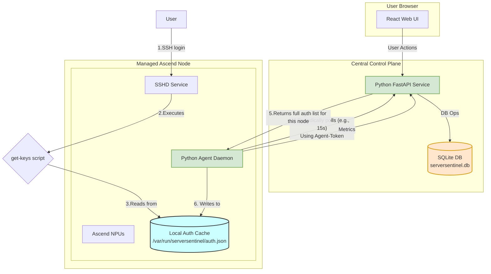
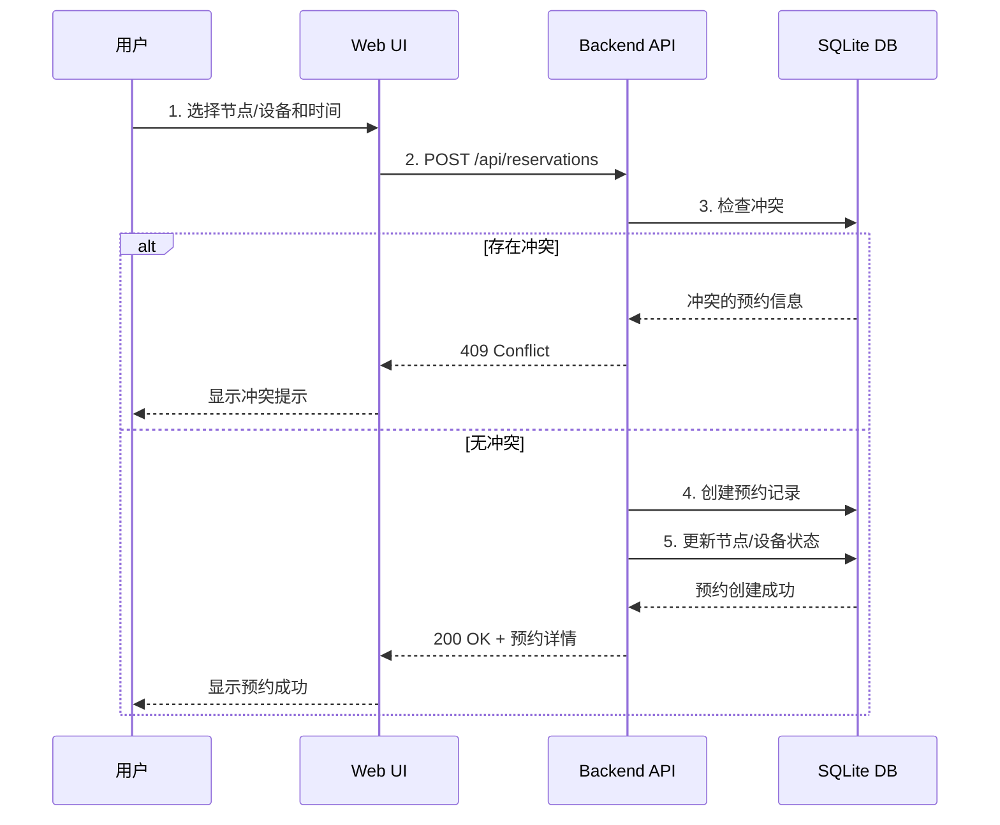
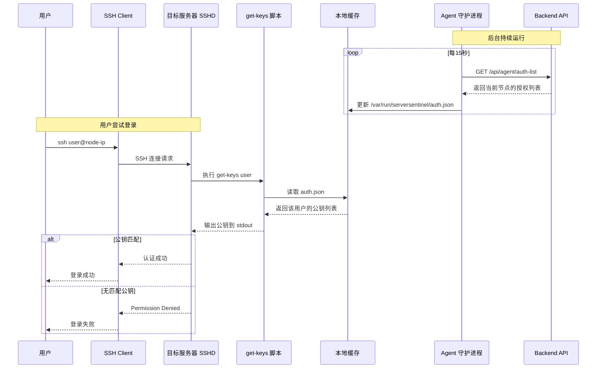
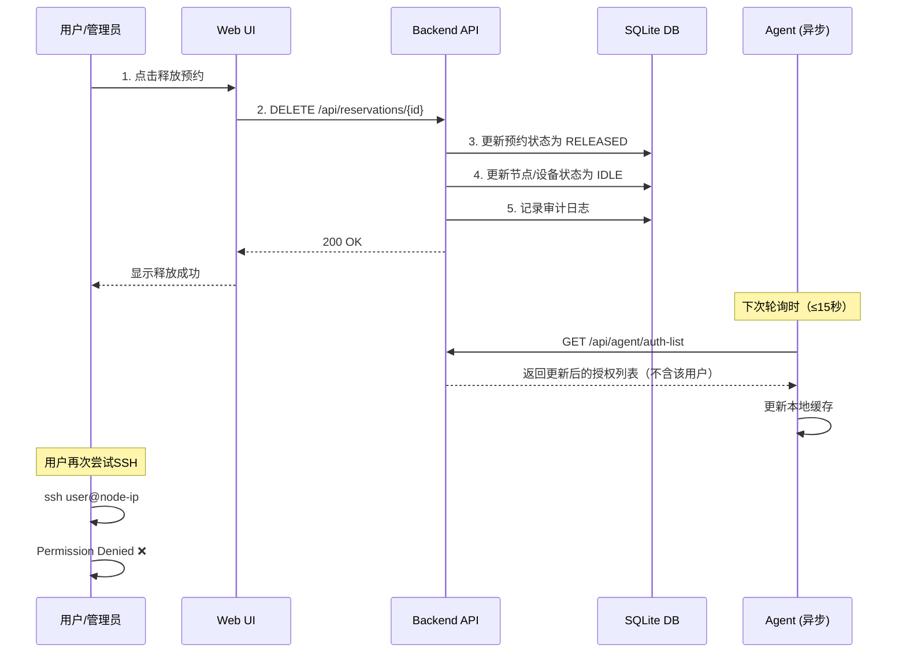
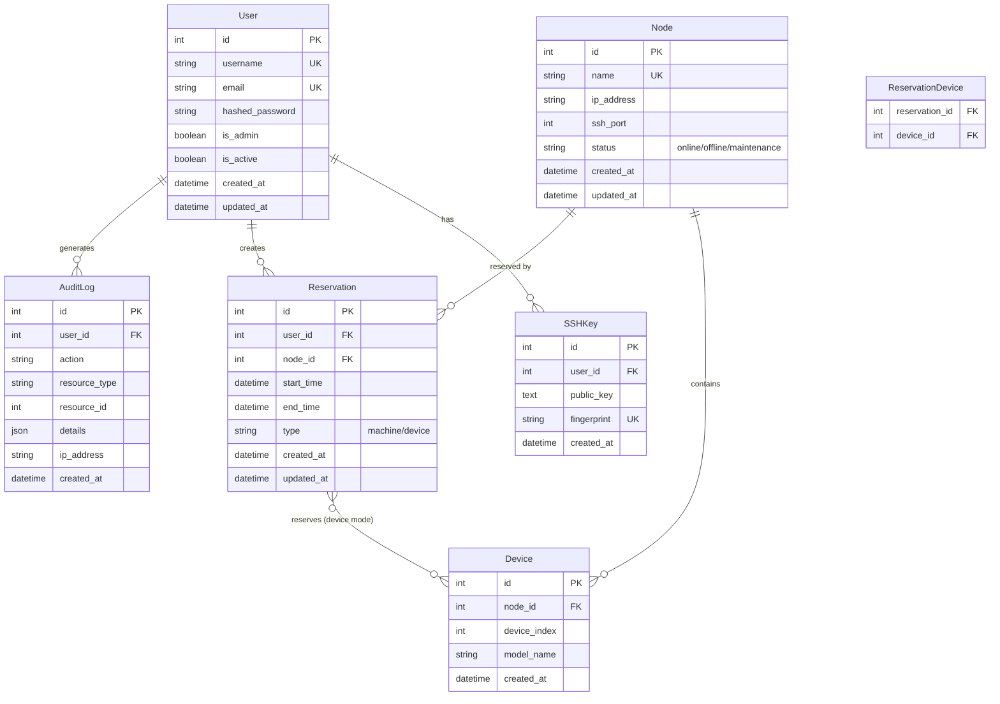

# ServerSentinel - 系统设计文档 (V4.0 - SQLite)

## 1. 架构概述 (Rev. 4.0)

本系统采用 **C/S (Client/Server) + Agent** 架构，所有组件均使用 **Python** 技术栈，以最大化团队开发效率和可维护性。采用 **SQLite** 作为数据库，实现零配置、轻量化部署。

1.  **ServerSentinel Backend (后端服务)**:
    *   **角色**: 中心控制大脑，授权策略的唯一事实来源 (Single Source of Truth)。
    *   **职责**: 提供安全的 RESTful API，处理所有业务逻辑，管理数据库。
    *   **技术选型**: **Python + FastAPI + SQLite**。

2.  **ServerSentinel Frontend (前端界面)**:
    *   **角色**: 用户交互界面 (Web UI)。
    *   **技术选型**: **React + TypeScript + Ant Design**。

3.  **ServerSentinel Agent (节点代理)**:
    *   **角色**: 部署在每台受管服务器 (Node) 上的持久化守护进程。
    *   **职责**: 安全注册、缓存授权策略、采集指标、提供本地SSH密钥查询脚本。
    *   **技术选型**: **Python** (使用 PyInstaller 打包)。

### 1.1 架构图 (Rev. 4.0)



```

## 2. 核心工作流设计

### 2.1 用户预约流程



**关键逻辑：冲突检测算法**

1. **整机 vs 整机**：时间重叠即冲突
2. **整机 vs 卡级**：时间重叠即冲突（整机独占所有资源）
3. **卡级 vs 卡级**：时间重叠 + 设备ID有交集才冲突

### 2.2 SSH 授权流程（Phase 2）



### 2.3 预约释放流程



## 3. 数据库模型 (ERD)

### 3.1 实体关系图



### 3.2 核心表说明

#### users 表
存储系统用户信息（白名单用户）。

| 字段 | 类型 | 说明 |
|------|------|------|
| id | INTEGER | 主键 |
| username | VARCHAR(50) | 用户名，唯一，对应Linux用户名 |
| email | VARCHAR(100) | 邮箱，唯一 |
| hashed_password | VARCHAR(255) | 密码哈希 |
| is_admin | BOOLEAN | 是否管理员 |
| is_active | BOOLEAN | 账户是否激活 |
| created_at | DATETIME | 创建时间 |
| updated_at | DATETIME | 更新时间 |

#### ssh_keys 表
存储用户的SSH公钥。

| 字段 | 类型 | 说明 |
|------|------|------|
| id | INTEGER | 主键 |
| user_id | INTEGER | 外键 → users.id |
| public_key | TEXT | SSH公钥内容 |
| fingerprint | VARCHAR(100) | 公钥指纹，唯一 |
| created_at | DATETIME | 创建时间 |

#### nodes 表
存储物理服务器信息。

| 字段 | 类型 | 说明 |
|------|------|------|
| id | INTEGER | 主键 |
| name | VARCHAR(100) | 节点名称，唯一 |
| ip_address | VARCHAR(45) | IP地址 |
| ssh_port | INTEGER | SSH端口，默认22 |
| status | VARCHAR(20) | 状态：online/offline/maintenance |
| created_at | DATETIME | 创建时间 |
| updated_at | DATETIME | 更新时间 |

#### devices 表
存储NPU设备信息。

| 字段 | 类型 | 说明 |
|------|------|------|
| id | INTEGER | 主键 |
| node_id | INTEGER | 外键 → nodes.id |
| device_index | INTEGER | 设备索引（0-7） |
| model_name | VARCHAR(50) | 设备型号（如 Ascend 910B） |
| created_at | DATETIME | 创建时间 |

**唯一约束**：(node_id, device_index)

#### reservations 表
存储预约记录。

| 字段 | 类型 | 说明 |
|------|------|------|
| id | INTEGER | 主键 |
| user_id | INTEGER | 外键 → users.id |
| node_id | INTEGER | 外键 → nodes.id |
| start_time | DATETIME | 开始时间 |
| end_time | DATETIME | 结束时间 |
| type | VARCHAR(20) | 类型：machine/device |
| created_at | DATETIME | 创建时间 |
| updated_at | DATETIME | 更新时间 |

#### reservation_devices 表（多对多关系）
存储卡级预约的设备关联。

| 字段 | 类型 | 说明 |
|------|------|------|
| reservation_id | INTEGER | 外键 → reservations.id |
| device_id | INTEGER | 外键 → devices.id |

**主键**：(reservation_id, device_id)

#### audit_logs 表
存储审计日志。

| 字段 | 类型 | 说明 |
|------|------|------|
| id | INTEGER | 主键 |
| user_id | INTEGER | 外键 → users.id，可为NULL（系统操作） |
| action | VARCHAR(50) | 操作类型 |
| resource_type | VARCHAR(50) | 资源类型 |
| resource_id | INTEGER | 资源ID |
| details | JSON | 详细信息 |
| ip_address | VARCHAR(45) | 客户端IP |
| created_at | DATETIME | 创建时间 |

### 3.3 索引与一致性约束

- `users.username` 唯一索引
- `users.email` 唯一索引
- `ssh_keys.fingerprint` 唯一索引
- `nodes.name` 唯一索引
- `nodes.(ip_address, ssh_port)` 唯一索引
- `devices.(node_id, device_index)` 唯一索引
- `reservations.(node_id, start_time, end_time)` 复合索引（冲突检测）
- `reservation_devices.(reservation_id, device_id)` 联合主键
- 所有时间字段使用 UTC，统一在服务端转换与校验

## 4. API 端点设计

### 4.1 认证相关

#### POST /api/auth/login
用户登录，返回JWT Token。

**请求体**：
```json
{
  "username": "zhangsan",
  "password": "password123"
}
```

**响应**：
```json
{
  "access_token": "eyJhbGciOiJIUzI1NiIs...",
  "token_type": "bearer",
  "user": {
    "id": 1,
    "username": "zhangsan",
    "email": "zhangsan@example.com",
    "is_admin": false
  }
}
```

#### GET /api/users/me
获取当前登录用户信息。

**响应**：
```json
{
  "id": 1,
  "username": "zhangsan",
  "email": "zhangsan@example.com",
  "is_admin": false,
  "created_at": "2026-01-01T10:00:00Z"
}
```

### 4.2 SSH公钥管理

#### POST /api/users/me/ssh-keys
上传SSH公钥。

**请求体**：
```json
{
  "public_key": "ssh-rsa AAAAB3NzaC1yc2EAAAADAQABAAAB..."
}
```

**响应**：
```json
{
  "id": 1,
  "fingerprint": "SHA256:abc123...",
  "created_at": "2026-01-01T10:00:00Z"
}
```

#### GET /api/users/me/ssh-keys
获取当前用户的所有公钥。

#### DELETE /api/users/me/ssh-keys/{key_id}
删除指定公钥。

### 4.3 节点管理（管理员）

#### POST /api/admin/nodes
创建节点。

**请求体**：
```json
{
  "name": "node-01",
  "ip_address": "192.168.1.100",
  "ssh_port": 22
}
```

#### GET /api/nodes
获取所有节点列表。

**响应**：
```json
[
  {
    "id": 1,
    "name": "node-01",
    "ip_address": "192.168.1.100",
    "status": "online",
    "devices": [
      {
        "id": 1,
        "device_index": 0,
        "model_name": "Ascend 910B"
      }
    ]
  }
]
```

#### POST /api/admin/nodes/{node_id}/devices
为节点添加设备。

**请求体**：
```json
{
  "device_index": 0,
  "model_name": "Ascend 910B"
}
```

### 4.4 预约管理

#### POST /api/reservations
创建预约。

**请求体（整机）**：
```json
{
  "node_id": 1,
  "start_time": "2026-01-10T09:00:00Z",
  "end_time": "2026-01-10T18:00:00Z",
  "type": "machine"
}
```

**请求体（卡级）**：
```json
{
  "node_id": 1,
  "start_time": "2026-01-10T09:00:00Z",
  "end_time": "2026-01-10T18:00:00Z",
  "type": "device",
  "device_ids": [1, 2]
}
```

**响应**：
```json
{
  "id": 1,
  "user_id": 1,
  "node_id": 1,
  "type": "device",
  "start_time": "2026-01-10T09:00:00Z",
  "end_time": "2026-01-10T18:00:00Z",
  "reserved_devices": [
    {"id": 1, "device_index": 0},
    {"id": 2, "device_index": 1}
  ],
  "created_at": "2026-01-09T15:00:00Z"
}
```

#### GET /api/reservations
查询预约列表（支持过滤）。

**查询参数**：
- `user_id`: 按用户过滤
- `node_id`: 按节点过滤
- `start_date`: 开始日期
- `end_date`: 结束日期

#### GET /api/reservations/my
获取当前用户的预约。

#### DELETE /api/reservations/{id}
释放预约。

### 4.5 Agent API（Phase 2）

#### GET /api/agent/auth-list
Agent获取授权列表。

**请求头**：
```
Authorization: Bearer <agent-token>
```

**响应**：
```json
{
  "node_id": 1,
  "authorizations": [
    {
      "username": "zhangsan",
      "ssh_keys": [
        "ssh-rsa AAAAB3NzaC1yc2EAAAADAQABAAAB..."
      ],
      "devices": [0, 1],
      "expires_at": "2026-01-10T18:00:00Z"
    }
  ]
}
```

#### POST /api/agent/heartbeat
Agent心跳。

**请求体**：
```json
{
  "node_id": 1,
  "status": "online",
  "timestamp": "2026-01-10T10:00:00Z"
}
```

### 4.6 API 规范（统一约定）

**错误体格式**：
```json
{
  "error": "conflict",
  "message": "reservation overlaps with existing reservation",
  "details": {
    "conflict_reservation_ids": [12, 13]
  }
}
```

**常用错误码**：
- `400` 参数校验失败
- `401` 未认证
- `403` 无权限
- `404` 资源不存在
- `409` 预约冲突
- `422` 业务规则冲突（如设备为空、时间无效）

**分页与排序**：
- 列表接口统一支持 `page`, `page_size`, `sort_by`, `order`。
- 默认 `page=1`, `page_size=20`, `order=desc`。

**幂等性约定**：
- `DELETE /api/reservations/{id}` 多次调用返回相同结果（已释放返回 200）。
- 设备级预约创建若重复提交，后端需确保不会产生重复记录（可选 `Idempotency-Key`）。

### 4.7 冲突检测算法（时间段重叠）

时间重叠条件（左闭右开）：
```
existing.start_time < new.end_time AND existing.end_time > new.start_time
```

**整机冲突 SQL 伪代码**：
```sql
SELECT id FROM reservations
WHERE node_id = :node_id
  AND status = 'active'
  AND start_time < :new_end
  AND end_time > :new_start;
```

**卡级冲突 SQL 伪代码**：
```sql
SELECT r.id FROM reservations r
JOIN reservation_devices rd ON rd.reservation_id = r.id
WHERE r.node_id = :node_id
  AND r.status = 'active'
  AND r.start_time < :new_end
  AND r.end_time > :new_start
  AND rd.device_id IN (:device_ids);
```

### 4.8 Agent 本地授权缓存格式（Phase 3）

文件路径：`/var/run/serversentinel/auth.json`

```json
{
  "node_id": 1,
  "generated_at": "2026-01-10T10:00:00Z",
  "authorizations": [
    {
      "username": "zhangsan",
      "ssh_keys": [
        "ssh-rsa AAAAB3NzaC1yc2EAAAADAQABAAAB..."
      ],
      "devices": [0, 1],
      "expires_at": "2026-01-10T18:00:00Z"
    }
  ]
}
```

## 5. 部署与实施计划

### 5.1 开发环境部署

#### 5.1.1 后端部署

```bash
# 1. 克隆项目
git clone https://github.com/your-org/ServerSentinel.git
cd ServerSentinel/backend

# 2. 创建虚拟环境
python3 -m venv venv
source venv/bin/activate  # Linux/Mac
# 或 venv\Scripts\activate  # Windows

# 3. 安装依赖
pip install -r requirements.txt

# 4. 配置环境变量
cp .env.example .env
# 编辑 .env 文件，设置 SECRET_KEY 等

# 5. 初始化数据库
alembic upgrade head

# 6. 创建管理员用户（可选）
python scripts/create_admin.py

# 7. 启动开发服务器
uvicorn app.main:app --reload --host 0.0.0.0 --port 8000
```

访问 http://localhost:8000/docs 查看API文档。

#### 5.1.2 前端部署

```bash
cd ServerSentinel/frontend

# 1. 安装依赖
npm install

# 2. 配置环境变量
cp .env.example .env.local
# 编辑 .env.local，设置 VITE_API_URL=http://localhost:8000

# 3. 启动开发服务器
npm run dev
```

访问 http://localhost:5173

### 5.2 生产环境部署（Docker）

#### 5.2.1 使用 Docker Compose

```yaml
# docker-compose.yml
version: '3.8'

services:
  backend:
    build: ./backend
    ports:
      - "8000:8000"
    volumes:
      - ./data:/app/data  # SQLite数据库持久化
    environment:
      - DATABASE_URL=sqlite:////app/data/serversentinel.db
      - SECRET_KEY=${SECRET_KEY}
    restart: unless-stopped

  frontend:
    build: ./frontend
    ports:
      - "80:80"
    depends_on:
      - backend
    restart: unless-stopped
```

**部署步骤**：

```bash
# 1. 设置环境变量
export SECRET_KEY=$(openssl rand -hex 32)

# 2. 启动服务
docker-compose up -d

# 3. 初始化数据库
docker-compose exec backend alembic upgrade head

# 4. 创建管理员
docker-compose exec backend python scripts/create_admin.py

# 5. 查看日志
docker-compose logs -f
```

### 5.3 Agent 部署（Phase 2）

#### 5.3.1 在目标服务器上安装 Agent

```bash
# 1. 下载 Agent 安装脚本
curl -O https://your-server.com/install-agent.sh
chmod +x install-agent.sh

# 2. 运行安装脚本
sudo ./install-agent.sh \
  --backend-url https://your-backend.com \
  --invite-code <从管理界面获取的邀请码>

# 3. 验证安装
sudo systemctl status serversentinel-agent
sudo journalctl -u serversentinel-agent -f
```

#### 5.3.2 配置 SSHD

Agent 安装脚本会自动修改 `/etc/ssh/sshd_config`：

```bash
# 添加以下配置
AuthorizedKeysCommand /usr/local/bin/serversentinel-get-keys %u
AuthorizedKeysCommandUser root
```

然后重启 SSHD：
```bash
sudo systemctl restart sshd
```

### 5.4 备份策略

#### 5.4.1 数据库备份

```bash
# 每日自动备份脚本
#!/bin/bash
BACKUP_DIR=/backup/serversentinel
DATE=$(date +%Y%m%d_%H%M%S)

# 备份SQLite数据库
cp /app/data/serversentinel.db $BACKUP_DIR/serversentinel_$DATE.db

# 保留最近30天的备份
find $BACKUP_DIR -name "serversentinel_*.db" -mtime +30 -delete
```

添加到 crontab：
```bash
0 2 * * * /usr/local/bin/backup-serversentinel.sh
```

#### 5.4.2 恢复数据库

```bash
# 停止服务
docker-compose stop backend

# 恢复数据库
cp /backup/serversentinel/serversentinel_20260110_020000.db /app/data/serversentinel.db

# 启动服务
docker-compose start backend
```

### 5.5 监控与日志

#### 5.5.1 应用日志

```bash
# 查看后端日志
docker-compose logs -f backend

# 查看Agent日志
sudo journalctl -u serversentinel-agent -f
```

#### 5.5.2 健康检查

```bash
# 后端健康检查
curl http://localhost:8000/health

# Agent健康检查
curl http://localhost:9090/health  # Agent内置健康检查端点
```

### 5.6 安全加固

1. **修改默认密钥**：生产环境必须修改 `SECRET_KEY`
2. **启用 HTTPS**：使用 Nginx 反向代理并配置 SSL 证书
3. **防火墙配置**：仅开放必要端口（80/443/22）
4. **定期更新**：及时更新系统和依赖包
5. **访问控制**：限制管理界面访问IP范围


## 6. 技术选型 (Technology Stack - SQLite Edition)

为确保项目的**轻量化、易部署**和可维护性，并最大化利用团队现有技能，我们选择以下技术栈。

| 领域 | 技术 | 备注 |
| :--- | :--- | :--- |
| **后端 (Backend)** | **Python + FastAPI** | FastAPI 提供现代化、高性能的异步API框架。结合Python的开发效率，是理想选择。 |
| | **SQLite** | 🆕 **轻量级嵌入式数据库**，零配置、单文件存储，非常适合10-20台服务器规模的部署。支持完整的SQL和事务，性能优秀。 |
| | **SQLAlchemy + Alembic** | SQLAlchemy 是Python生态中最强大的ORM框架，完美支持SQLite。Alembic 用于管理数据库结构的版本迁移。 |
| | **Pydantic** | FastAPI 内置使用，用于数据校验和序列化，极大提升代码健壮性。 |
| | **JWT (JSON Web Tokens)** | 用于用户登录认证和 API 无状态鉴权。 |
| **前端 (Frontend)** | **TypeScript + React** | TypeScript 提供强类型支持，提升代码质量和可维护性。React 是构建用户界面的主流选择。 |
| | **Ant Design** | 提供一套高质量、开箱即用的企业级 UI 组件库，加速前端开发。 |
| | **Vite** | 下一代前端构建工具，提供极致的开发服务器启动速度和打包性能。 |
| | **Axios / TanStack Query** | 用于处理 HTTP 请求和管理服务器状态，实现高效的数据获取和缓存。 |
| **代理 (Agent)** | **Python + PyInstaller** | **统一技术栈**，降低维护成本。使用 PyInstaller 将Agent脚本及其依赖打包成单个可执行文件，简化部署。 |
| **DevOps** | **Docker / Docker Compose** | 用于应用容器化，并统一本地开发、测试和生产环境。SQLite使得容器镜像更小、启动更快。 |
| | **GitHub Actions** | 用于实现 CI/CD，自动化代码检查、单元测试、构建和部署流程。 |
| | **Swagger / OpenAPI** | FastAPI **自动生成**交互式API文档，极大提升协作效率。 |

### 6.1 为什么选择 SQLite？

**优势：**
- ✅ **零配置**：无需安装和配置独立的数据库服务器
- ✅ **单文件存储**：整个数据库就是一个文件，备份和迁移极其简单
- ✅ **轻量化部署**：Docker镜像更小，资源占用更少
- ✅ **开发友好**：本地开发无需额外依赖，开箱即用
- ✅ **性能优秀**：对于中小规模应用，读取性能甚至优于MySQL
- ✅ **完整SQL支持**：支持事务、外键、索引等所有核心功能

**适用场景：**
- ✅ 10-50台服务器规模
- ✅ 并发用户数 < 100
- ✅ 预约操作频率适中（非高频写入场景）

**迁移路径：**
如果未来规模扩大（100+台服务器），可以通过SQLAlchemy无缝迁移到PostgreSQL或MySQL，代码改动极小。

---
**设计决策备忘 (Rev. 3.1)**:
*   **数据库选型**: 最终选择 MySQL，以更好地匹配团队现有技术栈和偏好。
*   **统一技术栈**: 整个项目后端和代理端都使用 Python，以降低团队认知负和维护成本。
*   **Agent部署**: 接受 PyInstaller 打包带来的文件体积增大的小缺点，以换取单一技术栈的巨大优势。
*   **授权延迟**: 权限的下发和撤销存在一个最大为 Agent 轮询周期的延迟（例如15秒），这是一个完全可以接受的权衡，换来了巨大的性能和稳定性提升。
*   **用户与系统用户映射**: 依然假设平台用户名与 Linux 用户名一致。`get-keys` 脚本可扩展以支持映射表。
*   **缓存文件安全**: 缓存文件的路径、权限设置至关重要，必须严格控制，防止非授权读取和篡改。
