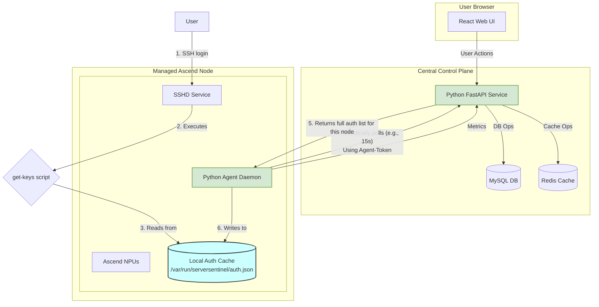

# ServerSentinel - 系统设计文档 (V3.1 - MySQL)

## 1. 架构概述 (Rev. 3.1)

本系统采用 **C/S (Client/Server) + Agent** 架构，所有组件均使用 **Python** 技术栈，以最大化团队开发效率和可维护性。

1.  **ServerSentinel Backend (后端服务)**:
    *   **角色**: 中心控制大脑，授权策略的唯一事实来源 (Single Source of Truth)。
    *   **职责**: 提供安全的 RESTful API，处理所有业务逻辑，管理数据库和缓存。
    *   **技术选型**: **Python + FastAPI**。

2.  **ServerSentinel Frontend (前端界面)**:
    *   **角色**: 用户交互界面 (Web UI)。
    *   **技术选型**: **React + TypeScript + Ant Design**。

3.  **ServerSentinel Agent (节点代理)**:
    *   **角色**: 部署在每台受管服务器 (Node) 上的持久化守护进程。
    *   **职责**: 安全注册、缓存授权策略、采集指标、提供本地SSH密钥查询脚本。
    *   **技术选型**: **Python** (使用 PyInstaller 打包)。

### 1.1 架构图 (Rev. 3.1)

## 2. 核心工作流设计 (Rev. 2)
*(此部分逻辑与语言无关，保持不变)*
...

## 3. 数据库模型 (ERD)
*(此部分逻辑与语言无关，保持不变)*
...

## 4. API 端点设计 (V2)
*(此部分逻辑与语言无关，保持不变)*
...

## 5. 部署与实施计划
*(此部分逻辑与语言无关，但具体任务的技术细节将在 `task.md` 中调整)*
...

## 6. 技术选型 (Technology Stack - Python Finalized)

为确保项目的高性能、稳定性和可维护性，并最大化利用团队现有技能，我们选择以下技术栈。

| 领域 | 技术 | 备注 |
| :--- | :--- | :--- |
| **后端 (Backend)** | **Python + FastAPI** | FastAPI 提供现代化、高性能的异步API框架。结合Python的开发效率，是理想选择。 |
| | **MySQL** | 作为主数据库，是全球最受欢迎的开源关系型数据库之一，社区成熟，性能可靠。 |
| | **Redis** | 用于高性能缓存，主要缓存实时监控指标、用户会话等，降低数据库压力。 |
| | **SQLAlchemy + Alembic** | SQLAlchemy 是Python生态中最强大的ORM框架。Alembic 用于管理数据库结构的版本迁移。 |
| | **Pydantic** | FastAPI 内置使用，用于数据校验和序列化，极大提升代码健壮性。 |
| | **JWT (JSON Web Tokens)** | 用于用户登录认证和 API 无状态鉴权。 |
| **前端 (Frontend)** | **TypeScript + React** | TypeScript 提供强类型支持，提升代码质量和可维护性。React 是构建用户界面的主流选择。 |
| | **Ant Design** | 提供一套高质量、开箱即用的企业级 UI 组件库，加速前端开发。 |
| | **Vite** | 下一代前端构建工具，提供极致的开发服务器启动速度和打包性能。 |
| | **Axios / TanStack Query** | 用于处理 HTTP 请求和管理服务器状态，实现高效的数据获取和缓存。 |
| **代理 (Agent)** | **Python + PyInstaller** | **统一技术栈**，降低维护成本。使用 PyInstaller 将Agent脚本及其依赖打包成单个可执行文件，简化部署。 |
| **DevOps** | **Docker / Docker Compose** | 用于应用容器化，并统一本地开发、测试和生产环境。 |
| | **GitHub Actions** | 用于实现 CI/CD，自动化代码检查、单元测试、构建和部署流程。 |
| | **Swagger / OpenAPI** | FastAPI **自动生成**交互式API文档，极大提升协作效率。 |

---
**设计决策备忘 (Rev. 3.1)**:
*   **数据库选型**: 最终选择 MySQL，以更好地匹配团队现有技术栈和偏好。
*   **统一技术栈**: 整个项目后端和代理端都使用 Python，以降低团队认知负和维护成本。
*   **Agent部署**: 接受 PyInstaller 打包带来的文件体积增大的小缺点，以换取单一技术栈的巨大优势。
*   **授权延迟**: 权限的下发和撤销存在一个最大为 Agent 轮询周期的延迟（例如15秒），这是一个完全可以接受的权衡，换来了巨大的性能和稳定性提升。
*   **用户与系统用户映射**: 依然假设平台用户名与 Linux 用户名一致。`get-keys` 脚本可扩展以支持映射表。
*   **缓存文件安全**: 缓存文件的路径、权限设置至关重要，必须严格控制，防止非授权读取和篡改。
